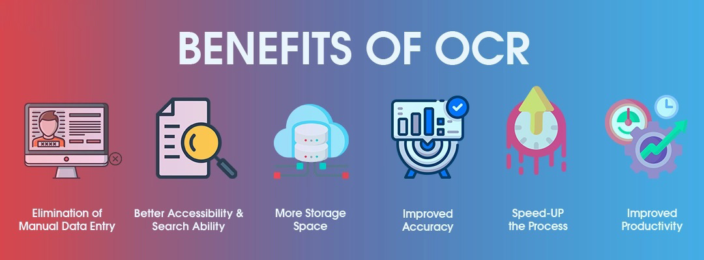
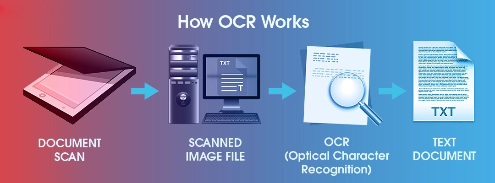
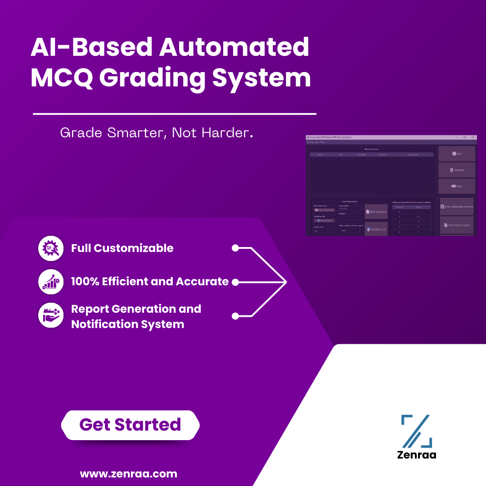

# AI Based Automated MCQ Grading System

The **AI Based Automated MCQ Grading System** is designed to revolutionize the process of grading multiple-choice question (MCQ) exams. Leveraging the power of Optical Character Recognition (OCR) and intelligent processing, this system automates the grading process, ensuring efficiency, accuracy, and a streamlined workflow for educational institutions and organizations.

---

## Table of Contents
- [Features](#features)
- [Benefits](#benefits)
- [How It Works](#how-it-works)
- [Screenshots](#screenshots)
- [Get Started](#get-started)
- [Contact](#contact)

---

## Features

- **Full Customization**: Tailor the grading system to your specific exam formats and requirements.
- **High Efficiency and Accuracy**: Achieve precise and reliable results in grading large volumes of MCQ exams.
- **Automated Report Generation**: Generate detailed reports and receive notifications with ease.
- **User-Friendly Interface**: Intuitive design for easy navigation and operation.

---

## Benefits

1. **Elimination of Manual Data Entry**: Saves time and reduces human error.
2. **Better Accessibility and Search Ability**: Digital records for easier access and retrieval.
3. **More Storage Space**: Reduces physical storage needs by digitizing answer sheets.
4. **Improved Accuracy**: Ensures consistent grading outcomes.
5. **Speed-Up the Process**: Rapid processing reduces turnaround time for results.
6. **Improved Productivity**: Frees up educators' time for more important tasks.

---

## How It Works

1. **Document Scan**: MCQ answer sheets are scanned.
2. **Scanned Image File**: The system reads the image data.
3. **OCR Processing**: Optical Character Recognition identifies student answers.
4. **Text Document**: The extracted data is matched against the answer key for grading.

---

## Screenshots

*Visual representation of the system interface and its functionalities.*

---

## Get Started

To get started with the **AI Based Automated MCQ Grading System**, visit [Zenraa](https://www.zenraa.com) and explore how you can implement this solution in your academic or organizational environment.

---

## Contact

For more information or inquiries:
- Visit our website at [Zenraa](https://www.zenraa.com)
- Email: [sihabsahariarcse@gmail.com](mailto:sihabsahariarcse@gmail.com)
